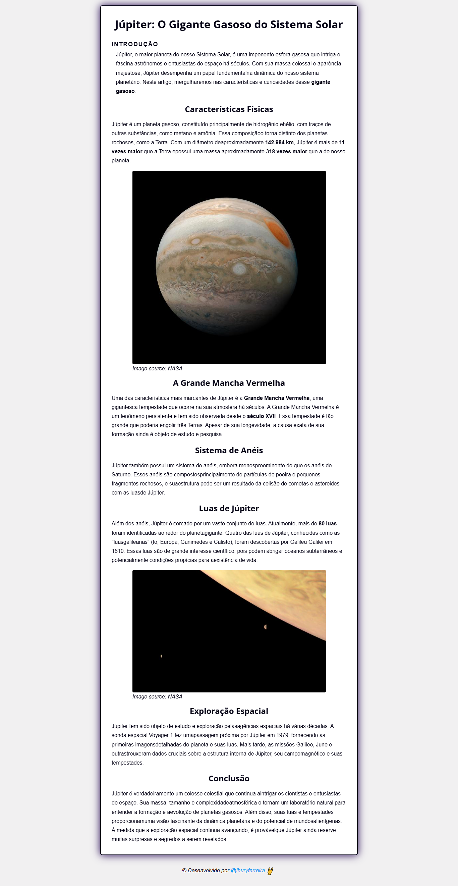

## 🪐 Artigo Júpiter

### 🚀 Sobre o projeto

> Este projeto é uma página web informativa sobre Júpiter, o maior planeta do Sistema Solar. A página apresenta diversas seções que detalham as características físicas, a Grande Mancha Vermelha, o sistema de anéis, as luas e a exploração espacial de Júpiter.

### 🛠️ Tecnologias Utilizadas

<code></code>
<code></code>

### 📂 Estrutura do Projeto

- `index.html`: Estrutura principal da página.
- `src/styles/style.css`: Estilos personalizados para a página.
- `src/imagens/`: Diretório contendo as imagens utilizadas na página.